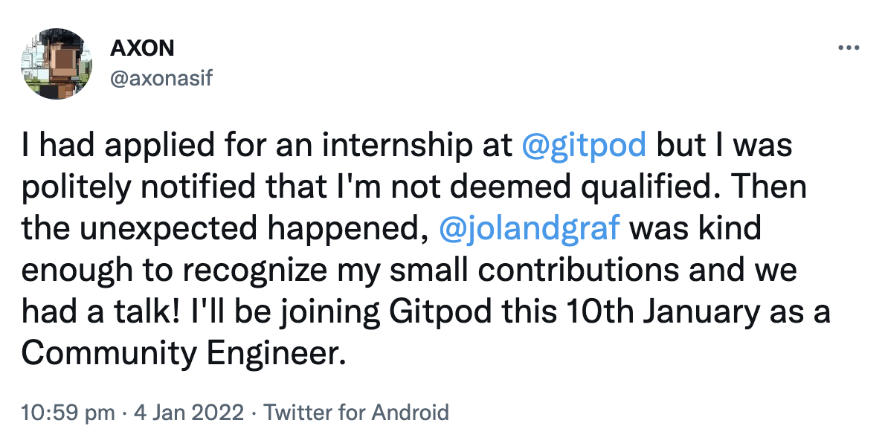

This story is about how Gitpod enabled an 18-year-old student from Dhaka with a broken laptop to continue developing software on an Android phone seamlessly. From learning to code in [Rust](https://www.rust-lang.org/learn) to developing [Optimus Discord Bot](https://github.com/supremegamers/optimus), which is now powering the Gitpod Community Discord server, I learned a lot! 🥳

With Gitpod, developing software is easier, accessible and more productive than with a local development environment. How so? Gitpod is a complete dev environment running in the cloud, turning my android phone into a powerful dev machine. Put in different words, I get hold of data center hardware in my palm that is fine tuned for developing software.

I am known as AXON in the [Gitpod Community](https://www.gitpod.io/chat). I’ll be sharing my story of how Gitpod quite literally changed my life and enabled me to continue my journey into software development. Today, I’m a Community Engineer intern at Gitpod. Being an active community member and solving my development pains with Gitpod led me here!

A few years ago, I got into software development while exploring the [Android-x86](https://www.android-x86.org/) space. As a user, I wanted to play android games with it, but I ended up getting involved in its development. One day, my laptop broke because of all the overload I had put into it over the years. The only other device that I had on me was my Android phone. Luckily, this was around the same time I discovered Gitpod! I hoped that I would be able to recreate a functioning developer environment in the cloud, just using my phone and Gitpod. I used [Techno Spark 7 Pro (128/6GB)](https://www.gsmarena.com/tecno_spark_7_pro-10884.php) with a Bluetooth mouse and keyboard combo, which I also connected with the TV for a larger screen. With this new setup, I could start working on almost any project. I also had a native Linux environment within my phone where I could `chroot` into with my phone's superuser privileges. Still, it wasn't suitable for software development, given the hardware and software limitations and all the other hassles. Using Gitpod, my Android phone effectively turned into a thin client with an interface to write code. Gitpod provisioned a developer environment in a Linux container in the cloud and was doing the brunt of computing work, and my phone was resting in peace 🤣

# Getting started with Gitpod on Android

Getting started with Gitpod on Android is quite easy. If you are interested in setting up Gitpod on Android, you can check out the [detailed guide](../guides/getting-started-with-gitpod-in-android).

`youtube: Aepvv_OqRYU`

- Step 1: Install [Kiwi](https://kiwibrowser.com/) browser 🥝
- Step 2: Install the [Gitpod extension](https://chrome.google.com/webstore/detail/gitpod-online-ide/dodmmooeoklaejobgleioelladacbeki) in Kiwi browser 🍊
- Step 3: Open a Git repository in Gitpod ⚡️
- Step 4: Code, Develop, Ship it 🚀

# Things I built/maintained with Gitpod on my Android phone

Here are some fun things I did:

- [Optimus Discord Bot](https://github.com/supremegamers/optimus) - This hackathon project is now powering our Gitpod Community Discord server 🎉 I had started developing the first version of it for [https://aopc.dev/](https://aopc.dev/) discord server but the compile times were unbearable until I found Gitpod.
- [GearLock](https://github.com/axonasif/gearlock) - Maintaining a bootable custom-recovery and package manager for Android-x86.
- [Tuxdroid](https://github.com/tuxdroid-io/tuxdroid) - This script manages my Linux GUI and the terminal environment on my phone, and an interesting fact - I programmed it on my phone to use it for my phone 😆. I can run VS Code inside my phone with the help of this, which also enables me to connect to a Gitpod workspace via Remote-SSH and more!
- [Bashbox](https://github.com/bashbox/bashbox) - A _bash compiler_ that helps me create modular and maintainable bash projects. I also used it for creating **Tuxdroid** above in a very short time!
- [DarkMatter](https://github.com/supremegamers/darkmatter) - Maintaining a customized Android-x86 distro.
- [multitux-gp](https://github.com/axonasif/multitux-gp) - Attempt to parse Gitpod `workspace-images` Dockerfiles and generate them for different distros. It's still a work in progress!

# How I got an Internship at Gitpod

I had applied for the **[Professional Open Source](https://www.gitpod.io/docs/professional-open-source)** plan after running out of free hours. Surprisingly, I was found eligible for it!

That really inspired me! All my tiny little projects weren't worthless afterall. Since then, I have strongly wanted to give something back to the Gitpod Community. I started hanging out with the Gitpod community and helping others whenever possible. It made me feel happy. I consider this as a method of learning things as you get presented with new challenges everyday.

Around that time Gitpod also launched the [Community Heroes program](https://www.gitpod.io/community/heroes) - an initiative that recognises the most active community members that go above and beyond to contribute to community 🍊🦸. I was recognised for my consistent efforts and was a member of the [first cohort](https://twitter.com/gitpod/status/1466452229309837313) 😎

Later, I had applied for an internship at Gitpod. It was kind of an unexpected event for me: I got the internship, and officially, I became a Gitpodder 🍊

# Unlocking the power of Gitpod

Can you believe it? All the contributions and projects have been made from my phone, using the power of Gitpod! Gitpod is powerful, and I believe with Gitpod, anyone can learn to code and develop software without any hurdles.

Drop by our community Discord server if you find this interesting and want to develop software on your phone. We have the [#mobile-and-tablets](https://discord.com/channels/816244985187008514/890901203624534026) channel where fellow mobile-dev enthusiasts hang out! Feel free to share your tips and tricks on software engineering in a more unconventional but accessible way.
